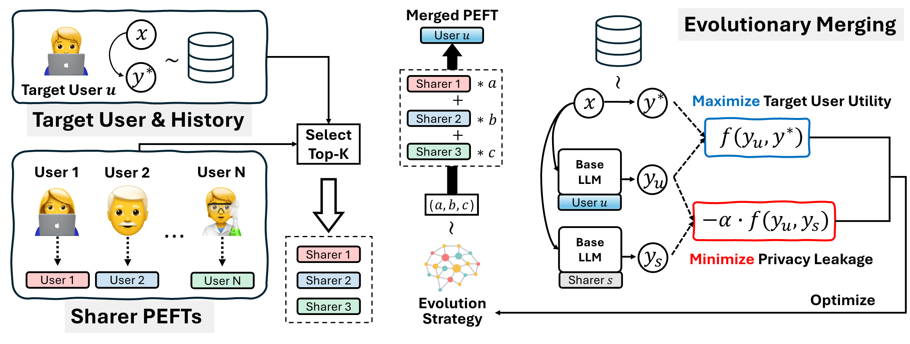

<h1 align="center"> Personalized Language Models via<br>Privacy-Preserving Evolutionary Model Merging </h1>


<div align="center" style="line-height: 1;">
  <a href="https://arxiv.org/abs/2503.18008" target="_blank">
    
  </a>
  <a href="https://github.com/kykim0/PriME" target="_blank">
    
  </a>
</div>


## Updates

* 11/2025: 💻 We release our full codebase.
* 09/2025: 🎉 Our paper is selected for an oral presentation.
* 08/2025: 🎉 Our paper is accepted to EMNLP. See you at the conference!


## Overview

Personalization in language models aims to tailor model behavior to individual users or user groups. Prompt-based methods incorporate user preferences into queries, while training-based methods encode them into model parameters. Model merging has also been explored for personalization under limited data. However, existing methods often fail to directly optimize task-specific utility and lack explicit mechanisms for privacy preservation.

<br>
<div align="center">

</div>
<br>

To address the limitations, we propose Privacy-Preserving Model Merging via Evolutionary Algorithms (PriME), a novel personalization approach that employs gradient-free methods to directly optimize utility while reducing privacy risks. By integrating privacy preservation into the optimization objective, PriME creates personalized modules that effectively capture target user preferences while minimizing privacy risks for data-sharing users. Experiments on the LaMP benchmark show that PriME consistently outperforms a range of baselines, achieving up to a 45% improvement in task performance. Further analysis demonstrates that PriME achieves a superior privacy-utility trade-off compared to a prior state-of-the-art, with enhanced robustness to membership inference attacks and greater utility in capturing user preferences.


## Usage

For a fair comparison with the baseline, we adopt the official [Per-Pcs](https://github.com/TamSiuhin/Per-Pcs) codebase for task adaptation, anchor selection, and training sharer PEFTs, with additional code clean-ups, refactoring, and support for Llama 3 models. This also means that we use their relatively low-level Llama training and inference code, as Per-Pcs introduces several architectural modifications that require changes to the model's internal code. In contrast, PriME requires no architectural changes, making it much easier to use with standard Transformers and other Hugging Face libraries.

We use the Llama-2-7b, Llama3.1-8B, and Llama3.2-3B models for our experiments. The model weights can be downloaded from the [official website](https://www.llama.com/llama-downloads/). For the code examples below, we assume that the checkpoints are located in ```./llama/checkpoints```. For data, we use the [LaMP](https://arxiv.org/abs/2304.11406) benchmark, specifically the version processed by the authors of Per-Pcs, which is better suited for model merging experiments. The data can be accessed [here](https://drive.google.com/file/d/1KyiQGWGxNVcqoRXqgMqaq11xEiVJ2Axn/view?usp=sharing). After downloading, unzip the data and place it under ```./data```.


### Installation

```bash
# Clone codebase
git clone git@github.com/kykim0/PriME.git && cd PriME

# Prepare environment
conda create -y -n prime python=3.10
conda activate prime

# Install dependencies
pip install -r requirements.txt
```


### Task adaptation, anchor selection, training sharer PEFTs

The ```task_name``` argument can be set to one of the following: ```citation```, ```movie_tagging```, ```news_headline```, ```product_rating```, ```scholarly_title```, and ```tweet_paraphrase```. Below, we use ```movie_tagging``` as an example.


#### Base LLM task adaptation

```bash
python task_LoRA.py \
    --task_name movie_tagging \
    --llama_model_path ./llama/checkpoints/Llama-2-7b \
    --tokenizer_path ./llama/checkpoints/Llama-2-7b \
    --output_dir ./output/movie_tagging/task-base_LLM
```


#### Anchor selection

We provide pre-computed anchor selection results under ```./anchor_selection```. Use the following command to compute anchor users from scratch.

```bash
python history_anchor.py --candidate_path ./data/movie_tagging/user_anchor_candidate.json --task_name movie_tagging
```


#### Training sharer user PEFT
```bash
python train_anchor_PEFT.py \
    --task_name movie_tagging \
    --llama_model_path ./llama/checkpoints/Llama-2-7b \
    --tokenizer_path ./llama/checkpoints/Llama-2-7b \
    --lora_ckpt ./output/movie_tagging/task-base_LLM/lora_ckpt.pt \
    --anchor_idx_path ./anchor_selection/movie_tagging/anchor_user_idx.pt \
    --output_dir ./output/movie_tagging/Anchor_PEFT/LoRA 
```


#### Training sharer user gate

Note that computing the gate vectors is only necessary for Per-Pcs.

```bash
python train_anchor_gate.py \
    --task_name movie_tagging \
    --llama_model_path ./llama/checkpoints/Llama-2-7b \
    --tokenizer_path ./llama/checkpoints/Llama-2-7b \
    --lora_ckpt ./output/movie_tagging/task-base_LLM/lora_ckpt.pt \
    --anchor_path ./output/movie_tagging/Anchor_PEFT/LoRA \
    --anchor_idx_path ./anchor_selection/movie_tagging/anchor_user_idx.pt \
    --output_dir ./output/movie_tagging/Anchor_PEFT/gate
```


### Personalization via model merging


#### Per-Pcs

Use the following command to run Per-Pcs for model merging. Note that the ```n_sim``` argument controls the number of top similar anchor users used for merging. By default, all anchor users are used but adjust this argument to ensure a fair comparison with PriME in terms of the MIA measure.

```bash
python lora_composition.py \
    --task_name movie_tagging \
    --llama_model_path ./llama/checkpoints/Llama-2-7b \
    --tokenizer_path ./llama/checkpoints/Llama-2-7b \
    --lora_ckpt ./output/movie_tagging/task-base_LLM/lora_ckpt.pt \
    --gate_dir ./output/movie_tagging/Anchor_PEFT/gate \
    --anchor_dir ./output/movie_tagging/Anchor_PEFT/LoRA \
    --n_sim 3 --topk 3 --recent_k 2000 --shared_ratio 1 --agg_temperature 1 \
    --output_dir ./output/movie_tagging/LoRA-Composition

python postprocess.py --task_name movie_tagging --output_dir ./output/movie_tagging/LoRA-Composition
```


#### PriME

Use the following command to create personalized PEFTs for test users with PriME. Again, the ```n_sim``` argument is used to control the number of top similar anchor users used for merging. In most experiments, setting ```n_sim``` to 3 was sufficient. The command below demonstrates using CMS-ES for evolutionary merging with an optimization budget of 10 and a similarity penalty (the $\alpha$ parameter in the objective) of 0.1.

```bash
python lora_composition_evo.py \
    --task_name movie_tagging \
    --llama_model_path ./llama/checkpoints/Llama-2-7b \
    --tokenizer_path ./llama/checkpoints/Llama-2-7b \
    --lora_ckpt ./output/movie_tagging/task-base_LLM/lora_ckpt.pt \
    --anchor_dir ./output/movie_tagging/Anchor_PEFT/LoRA \
    --n_sim 3 --opt_type cma --opt_budget 10 --sim_penalty 0.1 \
    --output_dir ./output/movie_tagging/LoRA-Composition-evo

python postprocess.py --task_name movie_tagging --output_dir ./output/movie_tagging/LoRA-Composition-evo
```


### MIA evaluation

After creating personalized PEFTs for test users with either PriME or Per-Pcs, use the following command to compute language modeling losses for member and non-member training points. The command outputs a JSON file containing these values for each test user. You can then use the results to compute the AUROC.

```bash
python3 mia.py \
    --task_name movie_tagging \
    --llama_model_path ./llama/checkpoints/Llama-2-7b \
    --tokenizer_path ./llama/checkpoints/Llama-2-7b \
    --lora_ckpt ./output/movie_tagging/task-base_LLM/lora_ckpt.pt \
    --gate_dir ./output/movie_tagging/Anchor_PEFT/gate \
    --anchor_dir ./output/movie_tagging/Anchor_PEFT/LoRA \
    --n_sim 3 --exp_dir ./output/movie_tagging/LoRA-Composition
```


## Citation ##

If our work is useful in your research, please consider citing it:
```bibtex
@inproceedings{kim2025personalized,
  title={Personalized Language Models via Privacy-Preserving Evolutionary Model Merging},
  author={Kim, Kyuyoung and Shin, Jinwoo and Kim, Jaehyung},
  booktitle={Proceedings of the 2025 Conference on Empirical Methods in Natural Language Processing},
  year={2025}
}

